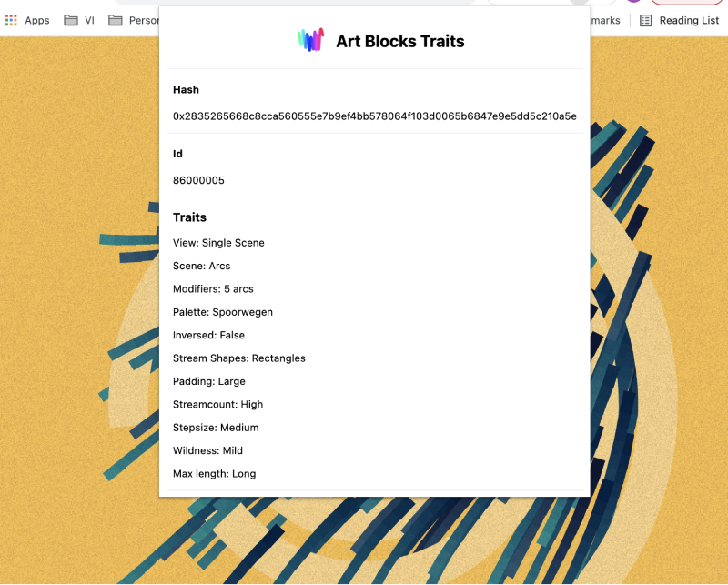

# Art Blocks Traits

Art Blocks Traits is a Chrome extension which allows you to review the traits your features script produces. By plugging in your own feature script, you can check the traits that are generated on main, rinkeby and with a little bit of extra code also on your own development environment.

## Installation

Clone this repo and add your features script to the root of the folder as `features.js`. The script should push features to an array called `features`. You don't have to define this array in your script.

Go to `chrome://extensions` and make sure 'developer mode' is enabled. Press `load unpacked` and select the folder you cloned the repo in. Now the extension should be available from your extensions menu in Chrome.

To enable this plugin to work on your own local environment, you have to add a bit of code that injects the tokendata in the head of your page. Do this after the function where you generate the tokenData. For example, in the [Art Blocks Starter Template](https://github.com/Asupkay/artblocks-starter-template), add the code seen below to `views/layouts/index.hbs` after line 27 where tokenData gets defined.

```javascript
let injectTokenData = () => {
  let head = document.getElementsByTagName("head")[0];
  const script = document.createElement('script');
  const td = `let td = { "hash": "${tokenData.hash}", "tokenId": "${tokenData.tokenId}" }`;
  script.textContent = td;
  head.appendChild(script, head.firstChild);
}

injectTokenData();
```

## Usage

After loading your features script in the root and unpacking and loading the plugin, you can go to the live view of a mint on main/rinkeby or to your localhost. Press the plugin from the menubar and a pop-up should appear showing your tokenId, hash and traits.

If you open the `features.js` script from the folder in your IDE, you can make edits and then save the file. Just re-open the plugin and the changes should be visible. No need to unpack the plugin again or run anything to refresh.

## ToDo

Currently, the plugin feels quite hacky (but it works!). There's some stuff I'd still like to do if this plugin proves to be useful:

1. Improve the UI
2. Add copy to clipboard functionality
3. Refactor some code
4. (More) error handling

## Contributing

Pull requests are welcome. For major changes, please open an issue first to discuss what you would like to change.
